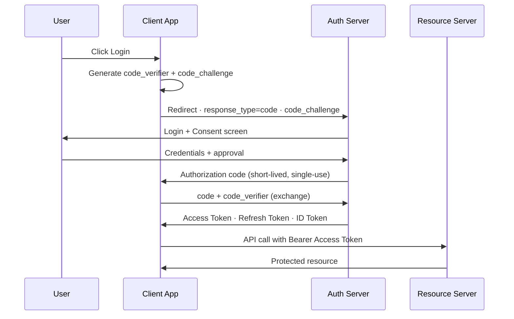
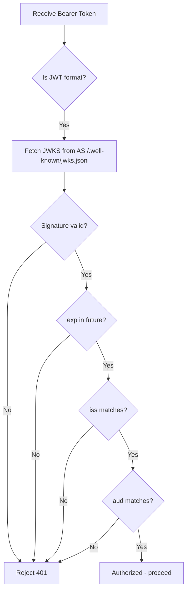

# OAuth2 & OIDC — Deep Dive

> **Level:** Beginner → Intermediate  
> **Pre-reading:** [08 · Security Summary](08-security.md)

---

## What Problem Does OAuth2 Solve?

Before OAuth2, apps asked users for their username/password directly to access third-party resources — a massive security risk. OAuth2 introduces **delegated authorization**: a user grants a client app limited access to their resources **without sharing credentials**.

!!! note "OAuth2 is NOT an authentication protocol"
    OAuth2 only answers "can this app access this resource?" — not "who is this user?"  
    **OIDC (OpenID Connect)** adds the identity layer on top of OAuth2 to answer "who is this user?"

---

## Core Roles

| Role | Description | Example |
|:-----|:------------|:--------|
| **Resource Owner** | The user who owns the data | End user |
| **Client** | App requesting access on behalf of the user | Your web/mobile app |
| **Authorization Server (AS)** | Issues tokens after authenticating the user | Auth0, Keycloak, AWS Cognito |
| **Resource Server (RS)** | Hosts the protected resource; validates tokens | Your API |

---

## Authorization Code + PKCE Flow (Current Best Practice)

**PKCE** (Proof Key for Code Exchange) prevents authorization code interception attacks — mandatory for public clients (SPAs, mobile apps).

**Why PKCE?** The `code_verifier` is never sent until the token exchange — even if an attacker intercepts the authorization code, they cannot exchange it without the verifier.

---

## Grant Types — When to Use Which

| Grant Type | Who Uses It | Has User? | Notes |
|:-----------|:------------|:----------|:------|
| **Authorization Code + PKCE** | Web apps, SPAs, mobile | ✅ Yes | Always use PKCE; the only correct choice for user-facing apps |
| **Client Credentials** | Backend services, daemons | ❌ No | `client_id` + `client_secret` exchanged for token; machine-to-machine only |
| **Device Flow** | TVs, CLI tools, IoT | ✅ Yes | App shows a code; user authenticates on another device |
| **Implicit** | *(Deprecated)* | ✅ Yes | Tokens returned in URL fragment; vulnerable to leakage — never use |
| **Resource Owner Password** | *(Deprecated)* | ✅ Yes | App receives password directly — defeats OAuth2's purpose |

!!! warning "Never use Implicit or Resource Owner Password grants"
    Both are deprecated in OAuth2.1. Implicit leaks tokens in browser history; ROPC bypasses the authorization server's value entirely.

---

## OIDC — Adding Identity to OAuth2

OIDC adds an **ID Token** (a JWT) to the OAuth2 flow. This token tells your app **who the user is**.

### ID Token Claims

| Claim | Meaning |
|:------|:--------|
| `sub` | Subject — unique user identifier at the IdP |
| `iss` | Issuer — URL of the Authorization Server |
| `aud` | Audience — your client's `client_id` |
| `exp` | Expiry timestamp |
| `iat` | Issued-at timestamp |
| `email` | User's email (if scope `email` requested) |
| `name` | User's display name (if scope `profile` requested) |

### OIDC Scopes

| Scope | What You Get |
|:------|:------------|
| `openid` | Required — triggers OIDC; returns ID Token |
| `profile` | `name`, `given_name`, `picture`, `locale` |
| `email` | `email`, `email_verified` |
| `offline_access` | Refresh Token for long-lived access |

---

## Token Validation — What Your Resource Server Must Do

!!! tip "Use your library's validation — don't roll your own"
    Libraries like `nimbus-jose-jwt` (Java), `python-jose`, or `jsonwebtoken` (Node) handle JWKS rotation, algorithm verification, and claim checking correctly. Manual validation almost always has gaps.

---

## Common Mistakes

| Mistake | Risk | Fix |
|:--------|:-----|:----|
| Not validating `aud` | Token issued for App A accepted by App B | Always check `aud` matches your service |
| Using Implicit grant | Token leaked via browser history, referrer | Switch to Auth Code + PKCE |
| Long-lived access tokens | Stolen token valid for hours/days | Short expiry (15 min); use refresh tokens |
| Not rotating refresh tokens | Stolen refresh token lasts forever | Enable refresh token rotation at AS |
| Trusting `alg: none` | Attacker strips signature entirely | Explicitly allowlist expected algorithms |

---

## SAML vs OAuth2 vs OIDC

| | SAML | OAuth2 | OIDC |
|:-|:-----|:-------|:-----|
| **Format** | XML | JSON/JWT | JSON/JWT |
| **Use case** | Enterprise SSO | API authorization | API authentication |
| **Transport** | Browser redirects | HTTP redirects | HTTP redirects |
| **Age** | 2002 | 2012 | 2014 |
| **Complexity** | High | Medium | Medium |
| **Best for** | Legacy enterprise IdP | Delegated API access | Modern login flows |

??? question "What is the difference between OAuth2 and OIDC?"
    OAuth2 is an **authorization** framework — it grants access to resources. OIDC is an **authentication** layer built on top of OAuth2 — it also tells you who the user is via an ID Token (JWT). You cannot use bare OAuth2 to log in a user; you need OIDC for that.

??? question "Why is PKCE needed for SPAs if they use HTTPS?"
    PKCE protects against **authorization code interception** — a malicious app on the same device registered for the same redirect URI can steal the code. PKCE binds the code to a secret only the originating app knows (`code_verifier`), so the stolen code is useless without it.

