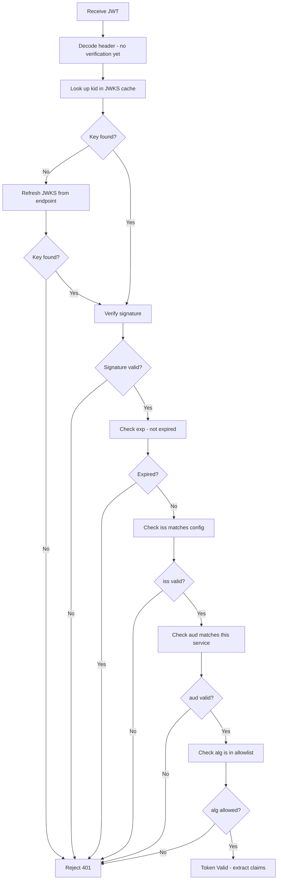

# JWT — Deep Dive

> **Level:** Intermediate  
> **Pre-reading:** [08 · Security Summary](08-security.md) · [08.01 · OAuth2 & OIDC](08.01-oauth2-and-oidc.md)

---

## Anatomy of a JWT

A JWT is three Base64URL-encoded parts separated by dots:

```
eyJhbGciOiJSUzI1NiIsInR5cCI6IkpXVCJ9   ← Header
.eyJzdWIiOiJ1c2VyMTIzIiwiZXhwIjoxNzE...  ← Payload
.SflKxwRJSMeKKF2QT4fwpMeJf36POk6yJV...   ← Signature
```

### Header

```json
{
  "alg": "RS256",
  "typ": "JWT",
  "kid": "key-id-2024"
}
```

| Field | Purpose |
|:------|:--------|
| `alg` | Signing algorithm — `RS256` (asymmetric, preferred), `HS256` (symmetric, shared secret) |
| `typ` | Token type — always `JWT` |
| `kid` | Key ID — tells the recipient which public key to use for verification (JWKS lookup) |

### Payload (Claims)

```json
{
  "sub": "user-123",
  "iss": "https://auth.example.com",
  "aud": "https://api.example.com",
  "exp": 1713000000,
  "iat": 1712996400,
  "jti": "unique-token-id",
  "roles": ["admin", "user"],
  "email": "user@example.com"
}
```

| Claim | Type | Meaning |
|:------|:-----|:--------|
| `sub` | Registered | Subject — unique user/service identifier |
| `iss` | Registered | Issuer — who created the token |
| `aud` | Registered | Audience — intended recipient(s) |
| `exp` | Registered | Expiry — Unix timestamp; reject if in the past |
| `iat` | Registered | Issued-at — when the token was created |
| `nbf` | Registered | Not-before — token invalid before this time |
| `jti` | Registered | JWT ID — unique ID; use for replay attack prevention |
| `roles`, `email` | Custom | Application-specific claims |

### Signature

- **RS256 (asymmetric):** Auth Server signs with private key; anyone can verify with the public key from JWKS endpoint. **Preferred for distributed systems.**
- **HS256 (symmetric):** Shared secret signs and verifies. Requires every service to know the secret — secret sprawl risk. Only acceptable for internal monolithic systems.

---

## RS256 vs HS256 — Which to Use?

| | RS256 | HS256 |
|:-|:------|:------|
| **Key type** | Private key (sign) · Public key (verify) | Shared symmetric secret |
| **Secret distribution** | Public key is public — safe to share | Secret must be distributed to every verifier |
| **Key rotation** | Rotate private key; publish new public key in JWKS | Must re-share secret with all services |
| **Use case** | Distributed microservices, third-party clients | Internal single-service use only |
| **Compromise impact** | Private key compromise affects signing only | Shared secret compromise affects all services |

!!! tip "Always use RS256 in microservices"
    With RS256 your resource servers only need the public JWKS endpoint. No secret sharing, no key sprawl. Auth server rotation is transparent.

---

## JWKS — Key Discovery and Rotation

Every standards-compliant Auth Server publishes its public keys at:
```
GET https://auth.example.com/.well-known/jwks.json
```

```json
{
  "keys": [
    {
      "kty": "RSA",
      "use": "sig",
      "kid": "key-id-2024",
      "n": "...",
      "e": "AQAB"
    }
  ]
}
```

Your service uses the `kid` in the JWT header to look up the correct key. This enables **zero-downtime key rotation** — publish a new key, old tokens still validate with old `kid`, new tokens use new `kid`.

---

## Complete Validation Checklist



---

## Security Vulnerabilities — Know These Cold

### 1. Algorithm Confusion (`alg: none`)

An attacker modifies the header to `"alg": "none"` and removes the signature. A naive library might accept this.

**Fix:** Explicitly configure your library with the **expected algorithm** — never derive it from the token itself.

```java
// WRONG — trusts whatever algorithm the token claims
JWTVerifier verifier = JWT.require(Algorithm.none()).build();

// CORRECT — explicitly specify RS256
JWTVerifier verifier = JWT.require(Algorithm.RSA256(publicKey)).build();
```

### 2. RS256 → HS256 Downgrade

If a server accepts both RS256 and HS256, an attacker can take the public key (which is public!) and sign a forged token with HS256 using the public key as the HMAC secret.

**Fix:** Never accept both RS256 and HS256 for the same endpoint. Pin the algorithm.

### 3. Missing `aud` Validation

A token issued for Service A is replayed against Service B.

**Fix:** Always validate `aud` matches **this specific service's identifier**.

### 4. Sensitive Data in Payload

JWT payload is only Base64 encoded — **it is not encrypted**. Any party with the token can decode and read the payload.

**Fix:** Never store passwords, PII, credit card numbers, or secrets in JWT claims. Use **JWE** (JSON Web Encryption) if you need encrypted tokens.

### 5. JWT Replay Attacks

A stolen valid JWT can be replayed until it expires.

**Fix options:**
- Keep expiry short (`exp` ≤ 15 minutes for access tokens)
- Use `jti` claim + maintain a denylist for sensitive operations
- Bind token to client fingerprint (IP, device) — advanced

---

## Token Storage — Browser Clients

| Storage | XSS Risk | CSRF Risk | Recommendation |
|:--------|:---------|:----------|:---------------|
| `localStorage` | High — JS can read it | None | ❌ Avoid for access tokens |
| `sessionStorage` | High — JS can read it | None | ❌ Avoid for access tokens |
| `httpOnly` Cookie | None — JS cannot read | Medium | ✅ Preferred; add `SameSite=Strict` or `Lax` |
| In-memory (JS var) | Low — gone on refresh | None | ✅ Good for SPAs with refresh token in httpOnly cookie |

!!! warning "localStorage is not safe for JWTs in the browser"
    Any XSS vulnerability in your app (or a third-party script) can steal tokens from `localStorage`. Use `httpOnly` cookies for refresh tokens and keep access tokens in memory.

---

## JWE — When You Need Encryption

**JWE** (JSON Web Encryption) encrypts the payload — not just signs it.

| | JWT (JWS) | JWE |
|:-|:---------|:----|
| **Payload** | Visible to anyone with the token | Encrypted; only recipient can read |
| **Use case** | Standard API auth | Sensitive claims (SSN, medical data) |
| **Complexity** | Low | Higher — key management needed |
| **Performance** | Fast | Slower (encryption overhead) |

---

??? question "Can you decode a JWT without the secret/private key?"
    Yes — the header and payload are only Base64URL encoded, not encrypted. Anyone can decode them. The signature prevents **tampering**, not **reading**. This is why you must never put sensitive data in JWT claims unless using JWE.

??? question "What happens when an Auth Server rotates its signing key?"
    The AS publishes the new public key in its JWKS endpoint alongside the old one. The new key gets a new `kid`. Old tokens still validate using the old key (by `kid` lookup). New tokens are signed with the new key. There is no downtime. Old keys are removed after they expire.

??? question "What is the difference between access token and refresh token?"
    **Access token:** Short-lived (minutes); presented on every API call; proves the caller's identity and permissions. **Refresh token:** Long-lived (days/weeks); only sent to the auth server to get a new access token; never sent to resource servers. If an access token is stolen, it expires quickly. If a refresh token is stolen, rotate it immediately and invalidate all sessions.

