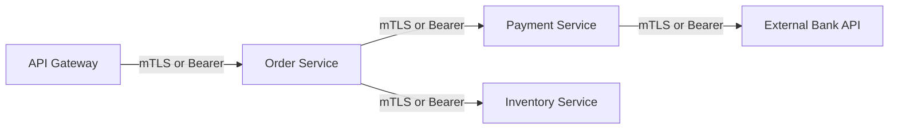
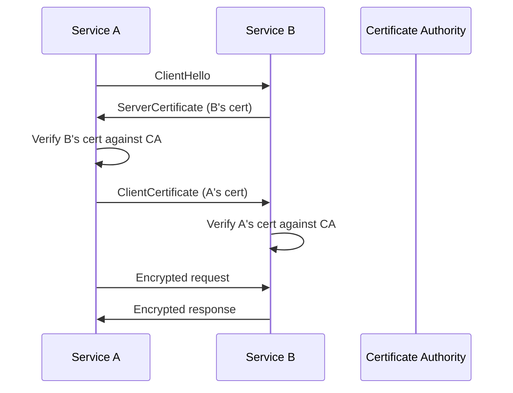
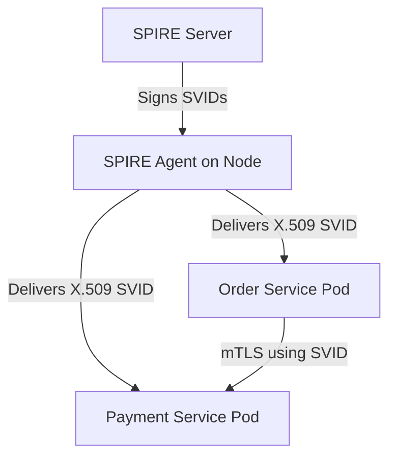
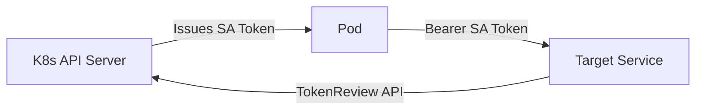
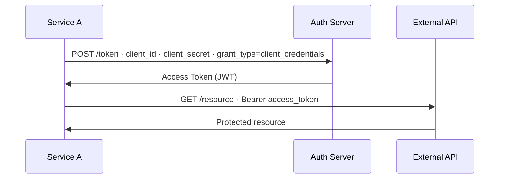

# Service-to-Service Authentication — Deep Dive

> **Level:** Intermediate  
> **Pre-reading:** [08 · Security Summary](08-security.md) · [08.02 · JWT Deep Dive](08.02-jwt-deep-dive.md)

---

## The Problem: Trust Between Services

In a microservices system, Service A calling Service B must prove its identity. There is no human user in the loop. The patterns below address **machine identity** — how a service proves who it is.



---

## Pattern 1: mTLS — Mutual TLS

Standard TLS only authenticates the **server** to the client. **mTLS** requires both sides to present X.509 certificates — bidirectional authentication at the transport layer.



| Aspect | Details |
|:-------|:--------|
| **Auth level** | Transport layer (L4) — below HTTP |
| **Identity proof** | X.509 certificate signed by trusted CA |
| **Code changes needed** | None if using a service mesh (Istio/Linkerd) |
| **Key management** | Certificates must be rotated before expiry |
| **Overhead** | Slight TLS handshake overhead; negligible in practice |

!!! tip "Let the service mesh handle mTLS"
    With Istio or Linkerd, mTLS is automatic and transparent — injected sidecar proxies handle the handshake. No application code changes. Enable `STRICT` mode so plaintext is rejected.

### Istio mTLS Modes

| Mode | Behavior |
|:-----|:---------|
| `PERMISSIVE` | Accepts both mTLS and plaintext — migration mode |
| `STRICT` | Rejects all plaintext; only mTLS allowed — production target |

```yaml
# Enforce STRICT mTLS for an entire namespace
apiVersion: security.istio.io/v1beta1
kind: PeerAuthentication
metadata:
  name: default
  namespace: production
spec:
  mtls:
    mode: STRICT
```

---

## Pattern 2: SPIFFE / SPIRE — Workload Identity

**SPIFFE** (Secure Production Identity Framework for Everyone) is an open standard for workload identity in dynamic infrastructure — the identity of a *running process*, not a human.

**SPIRE** is the reference implementation of SPIFFE.

| Term | Meaning |
|:-----|:--------|
| **SPIFFE ID** | URI identity: `spiffe://trust-domain/path` e.g. `spiffe://example.com/order-service` |
| **SVID** | SPIFFE Verifiable Identity Document — an X.509 cert or JWT carrying the SPIFFE ID |
| **Trust Domain** | Administrative boundary (e.g. your company or cluster) |
| **SPIRE Agent** | Runs on each node; attests workloads and delivers SVIDs |
| **SPIRE Server** | Signs SVIDs; manages trust bundles; validates attestation |



**Why SPIFFE over plain mTLS certs?**
- Automatic rotation (SVIDs are short-lived, often 1 hour)
- Cryptographic workload attestation (proves *what* the workload is, not just where)
- Works across clouds and clusters

---

## Pattern 3: Kubernetes Service Accounts

Every pod in Kubernetes is assigned a **Service Account** (SA). The SA token is a JWT mounted at `/var/run/secrets/kubernetes.io/serviceaccount/token`.



| Aspect | Details |
|:-------|:--------|
| **Token format** | JWT (since K8s 1.21: bound, audience-limited, time-limited) |
| **Mounted at** | `/var/run/secrets/kubernetes.io/serviceaccount/token` |
| **Audience** | Bound to specific audience since K8s 1.21 (prevents token reuse across services) |
| **Rotation** | Automatic since K8s 1.21 (kubelet rotates before expiry) |
| **Validation** | Via K8s TokenReview API or OIDC discovery endpoint |

!!! warning "Legacy SA tokens are long-lived and unbound"
    Pre-K8s 1.21 service account tokens never expired and had no audience. If you're running older clusters, explicitly configure `--service-account-issuer` and bound SA tokens. Disable auto-mounting with `automountServiceAccountToken: false` for pods that don't need it.

---

## Pattern 4: OAuth2 Client Credentials (Machine-to-Machine)

For services calling external APIs or third-party services, **OAuth2 Client Credentials** grant is the standard.



| Aspect | Details |
|:-------|:--------|
| **No user involved** | Machine-to-machine only |
| **Secret storage** | Store `client_secret` in Vault / Secrets Manager — never in code |
| **Token caching** | Cache access token until `exp - buffer`; avoid requesting new token every call |
| **Scopes** | Use narrow scopes — minimum permissions principle |

---

## Comparison: Which Pattern to Use?

| Scenario | Recommended Pattern |
|:---------|:-------------------|
| Microservices in same K8s cluster with Istio | mTLS via Istio (automatic, zero-code) |
| Microservices across clusters or clouds | SPIFFE/SPIRE (cross-boundary workload identity) |
| Pod calling K8s API directly | Kubernetes Service Account token |
| Service calling external third-party API | OAuth2 Client Credentials |
| On-prem services without service mesh | mTLS with manually managed certs |

---

## Short-Lived Credentials — Why They Matter

| Credential Type | Recommended Lifetime | If Compromised |
|:----------------|:--------------------|:---------------|
| Access Token (JWT) | 5–15 minutes | Useless after expiry |
| SPIFFE SVID (X.509) | 1 hour | Useless after expiry |
| K8s SA token (bound) | 1 hour | Useless after expiry |
| Client Secret (OAuth2) | Rotate every 90 days | Must rotate immediately |
| Long-lived API key | ❌ Avoid | Attacker has persistent access |

!!! tip "Design for automatic rotation"
    The blast radius of a leaked credential is directly proportional to its lifetime. If your credentials rotate automatically every hour, a stolen credential is mostly worthless before anyone notices.

---

??? question "What is the difference between mTLS and a JWT Bearer token for service-to-service auth?"
    mTLS authenticates at the **transport layer** using X.509 certificates — authentication happens before any HTTP is sent. JWT Bearer authenticates at the **application layer** — the service validates the token in the `Authorization` header. mTLS is stronger (cannot be stripped once enforced) but requires PKI infrastructure. JWTs are easier to implement but must be validated correctly in each service.

??? question "What is SPIFFE and when would you use it over plain mTLS?"
    SPIFFE is a **workload identity standard** that assigns a cryptographic identity (`spiffe://trust-domain/workload`) to running processes. Use it when you need: cross-cluster identity, automatic cert rotation, or multi-cloud environments. Plain mTLS with manually managed certs works for single-cluster setups but becomes operationally painful at scale — SPIRE solves that with automated attestation and rotation.

