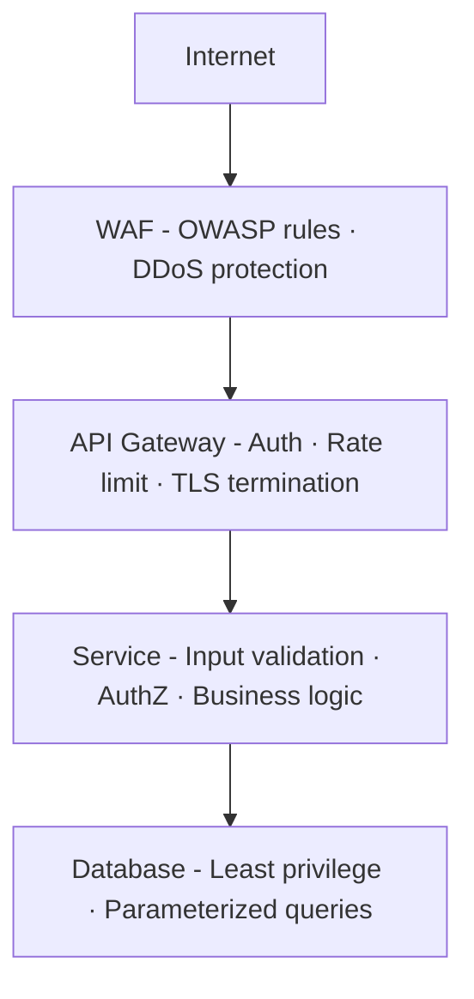
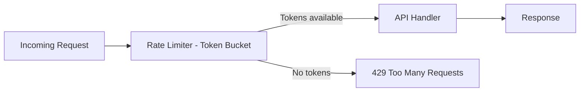

# API Security Patterns — Deep Dive

> **Level:** Intermediate  
> **Pre-reading:** [08 · Security Summary](08-security.md) · [08.01 · OAuth2 & OIDC](08.01-oauth2-and-oidc.md)

---

## Defense in Depth for APIs

API security is not a single control — it's **layered defenses**. An attacker who bypasses one layer hits the next.



---

## Transport Security

### HTTPS and HSTS

| Control | What It Does | How to Implement |
|:--------|:------------|:----------------|
| **HTTPS everywhere** | Encrypts traffic in transit; prevents eavesdropping | TLS 1.2 minimum; prefer TLS 1.3 |
| **HTTP → HTTPS redirect** | Forces upgrade from plaintext | 301 redirect + HSTS |
| **HSTS header** | Browser never connects over HTTP again | `Strict-Transport-Security: max-age=31536000; includeSubDomains` |
| **Certificate pinning** | Mobile apps reject unexpected certs | Use with caution — hard to rotate |

!!! tip "TLS 1.3 is significantly more secure than 1.2"
    TLS 1.3 removes weak cipher suites, requires forward secrecy, and has a faster handshake. Disable TLS 1.0 and 1.1 at the load balancer.

---

## Input Validation and Sanitization

**Every trust boundary is a validation boundary.** Validate at the edge (gateway) and again in each service.

| Input Type | Attack | Defense |
|:-----------|:-------|:--------|
| SQL parameters | SQL Injection | Parameterized queries / ORM; never string concat |
| HTML/JS fields | XSS | Encode output; use CSP headers; strip HTML on input |
| File uploads | Path traversal, malware | Validate extension + MIME type; scan content; store outside web root |
| JSON/XML payload | XXE, billion laughs | Disable external entity processing; set payload size limits |
| URL parameters | Open redirect | Validate redirect targets against allowlist |
| Headers | Header injection | Sanitize user-controlled header values |

```java
// WRONG — SQL injection vulnerability
String query = "SELECT * FROM users WHERE id = " + userId;

// CORRECT — parameterized query
PreparedStatement stmt = conn.prepareStatement("SELECT * FROM users WHERE id = ?");
stmt.setString(1, userId);
```

---

## CORS — Cross-Origin Resource Sharing

Browsers enforce **Same-Origin Policy** — JavaScript on `app.example.com` cannot call `api.example.com` unless the API explicitly allows it via CORS headers.

| CORS Header | Purpose | Safe Value |
|:-----------|:--------|:----------|
| `Access-Control-Allow-Origin` | Which origins can call this API | Explicit allowlist: `https://app.example.com` |
| `Access-Control-Allow-Methods` | Allowed HTTP methods | `GET, POST, PUT, DELETE` — only what's needed |
| `Access-Control-Allow-Headers` | Allowed request headers | `Content-Type, Authorization` |
| `Access-Control-Allow-Credentials` | Allow cookies/auth headers | `true` — only if needed AND origin is not `*` |
| `Access-Control-Max-Age` | Cache preflight response | `600` (10 minutes) |

!!! warning "Never use `Access-Control-Allow-Origin: *` with credentials"
    `*` + `credentials: true` is rejected by browsers and for good reason. An allowlist-only approach prevents any origin from calling your credentialed endpoints.

---

## Rate Limiting

Rate limiting prevents abuse, DDoS, brute force attacks, and accidental overload.

### Rate Limiting Strategies

| Strategy | Description | Use Case |
|:---------|:------------|:---------|
| **Fixed window** | N requests per window (e.g., 100 req/min) | Simple; susceptible to burst at window edge |
| **Sliding window** | Smooth window — counts requests in rolling timeframe | More accurate; higher memory cost |
| **Token bucket** | Tokens refill at rate R; burst up to bucket size | Allows controlled bursts; standard approach |
| **Leaky bucket** | Requests processed at fixed rate; excess queued/dropped | Smooth output rate; no bursts |

### Rate Limiting Dimensions

| Dimension | Example | Notes |
|:----------|:--------|:------|
| Per IP | 100 req/min per IP | Easy to bypass with distributed bots |
| Per API key | 1000 req/min per client | Good for SaaS; ties to account |
| Per user | 50 req/min per authenticated user | Requires auth; most precise |
| Per endpoint | `/login` limited to 5 req/min | Brute force protection |
| Global | 10,000 req/sec total | Platform-level protection |



---

## Authentication and Authorization at the API Layer

### Authentication Patterns

| Pattern | Where Validated | Notes |
|:--------|:---------------|:------|
| **JWT Bearer** | Each service validates locally | Stateless; no DB lookup needed |
| **Opaque token (API key)** | Introspection endpoint or cache | Simpler for external developers; revocable |
| **Session cookie** | Server-side session store | Stateful; use for browser-facing apps |
| **mTLS** | Transport layer | No application code needed; strongest for service-to-service |

### Authorization Patterns

| Pattern | Description | Best For |
|:--------|:------------|:---------|
| **RBAC** (Role-Based) | Permissions assigned to roles; users get roles | Most apps; straightforward to implement |
| **ABAC** (Attribute-Based) | Policy evaluates attributes (user, resource, env) | Fine-grained access; complex policies |
| **ReBAC** (Relation-Based) | Access based on relationships (Google Zanzibar model) | Social, document sharing |
| **OAuth2 Scopes** | Token carries allowed operations | API-level coarse-grained authorization |

---

## OWASP API Security Top 10 — Detailed

| # | Risk | Attack Example | Mitigation |
|:--|:-----|:--------------|:-----------|
| **1 BOLA** | Broken Object Level Auth | `GET /orders/456` — user can see other's orders | Validate that the requesting user owns or has access to object 456 |
| **2 Broken Auth** | Weak token validation | Expired JWT accepted; `alg: none` accepted | Validate all JWT claims; pin algorithm |
| **3 BOPLA** | Broken Object Property Level Auth | `PATCH /user` accepts `{"role": "admin"}` | Use allowlist of updatable fields; never mass-assign |
| **4 Unrestricted Resource Consumption** | No rate limits | Attacker calls `/export` 10,000 times | Rate limit + payload size limits + timeout |
| **5 Broken Function Level Auth** | User calls `DELETE /admin/users/123` | Validate role/permission on every endpoint; not just UI |
| **6 Unrestricted Access to Sensitive Business Flows** | Bulk coupon redemption bot | Business-level rate limiting; CAPTCHA; anomaly detection |
| **7 SSRF** | `POST /fetch?url=http://169.254.169.254/` | Validate/allowlist URLs; block internal IP ranges |
| **8 Security Misconfiguration** | Default creds, debug endpoints exposed | Automated config scanning; disable debug in prod |
| **9 Improper Asset Management** | Old API version `/v1/` without auth | Version sunset policy; API inventory |
| **10 Unsafe API Consumption** | Trusting external API response without validation | Validate and sanitize all external responses |

---

## Security Headers — Quick Reference

```http
Strict-Transport-Security: max-age=31536000; includeSubDomains; preload
Content-Security-Policy: default-src 'self'; script-src 'self'
X-Content-Type-Options: nosniff
X-Frame-Options: DENY
Referrer-Policy: strict-origin-when-cross-origin
Permissions-Policy: geolocation=(), microphone=()
```

---

## Error Handling — Don't Leak Information

| ❌ Bad Response | ✅ Good Response |
|:---------------|:----------------|
| `SQLException: Table 'users' doesn't exist` | `Internal server error. Reference: ERR-1042` |
| `User not found: user@example.com` | `Invalid credentials` (don't confirm email exists) |
| `Access denied for role 'VIEWER' on resource 'admin'` | `403 Forbidden` |
| Full stack trace in response body | Log internally; return generic error to client |

!!! warning "Stack traces in API responses are a reconnaissance gift"
    They reveal your technology stack, internal class names, file paths, and logic. Always log details server-side and return only a reference ID to the client.

---

??? question "What is BOLA and why is it the #1 API risk?"
    BOLA (Broken Object Level Authorization) means your API does not verify that the caller *owns or has access to the specific object* they're requesting. Example: `GET /invoice/9999` — if your app only checks "is the user logged in?" but not "does user A own invoice 9999?", any authenticated user can access any invoice. It's #1 because it's easy to miss — especially in auto-generated CRUD APIs — and trivially easy to exploit.

??? question "What is the difference between rate limiting and throttling?"
    **Rate limiting** caps the number of requests a client can make in a time window (hard stop — 429 after limit). **Throttling** slows requests down or queues them rather than rejecting them. Rate limiting protects against abuse and overload. Throttling ensures fair resource distribution without hard rejection. Use rate limiting at the API gateway and throttling inside services.

