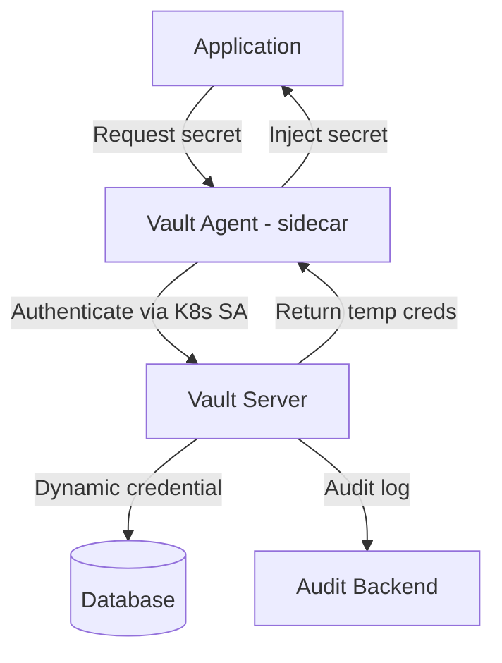
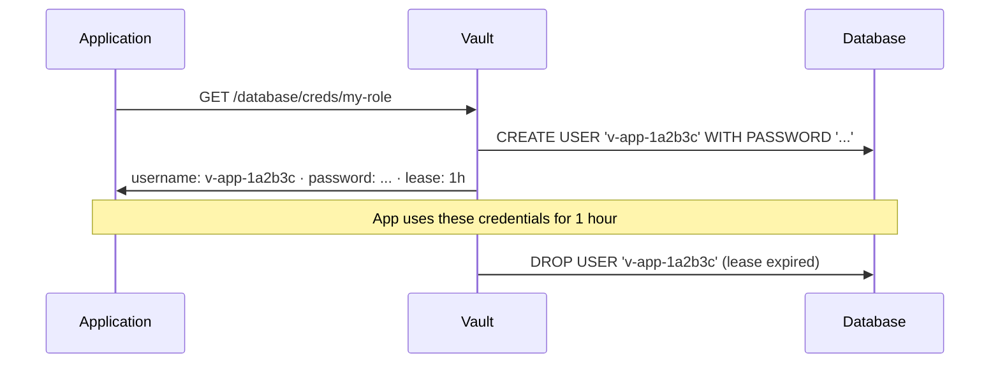
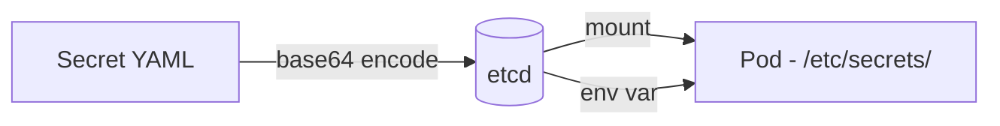
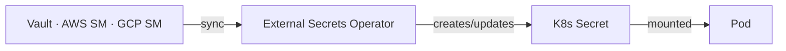
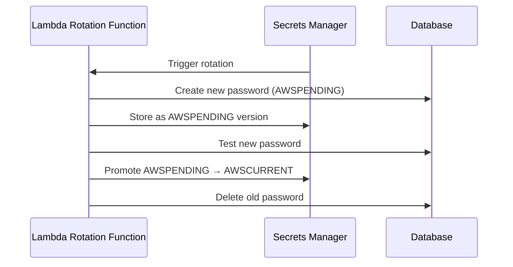

# Secrets Management — Deep Dive

> **Level:** Intermediate  
> **Pre-reading:** [08 · Security Summary](08-security.md)

---

## What Is a Secret?

A **secret** is any sensitive value your application needs at runtime that must not be exposed to unauthorized parties.

| Secret Type | Examples |
|:-----------|:---------|
| **Credentials** | Database passwords, API keys, service account tokens |
| **Certificates & keys** | TLS private keys, signing keys, encryption keys |
| **Configuration secrets** | Connection strings, OAuth2 client secrets |
| **Tokens** | CI/CD tokens, cloud provider credentials |

---

## The Anti-Patterns — What Not to Do

| Anti-Pattern | Risk | How Often It Happens |
|:-------------|:-----|:--------------------|
| Secrets hardcoded in source code | Anyone with repo access sees them; leaked in git history forever | Extremely common |
| Secrets in `.env` files committed to Git | Same as above; even worse if public repo | Very common |
| Secrets in environment variables set at deploy time via CI | Visible in CI logs; hard to rotate | Common |
| Secrets in Dockerfile `ENV` or `ARG` | Baked into image layers; visible in `docker history` | Common |
| Secrets in Kubernetes `ConfigMap` | ConfigMaps are not encrypted at rest by default | Common |
| Shared secrets across services | Rotating one breaks all; blast radius of leak is large | Common |

!!! warning "Git history is permanent"
    Even if you delete a secret from a file and commit, it lives in git history. Use `git-filter-repo` to purge it and **rotate the secret immediately** — assume it's compromised.

---

## HashiCorp Vault — Architecture

Vault is the industry standard for secrets management in large-scale microservices.

### Key Vault Concepts

| Concept | Description |
|:--------|:------------|
| **Secrets Engine** | Plugin that stores or generates secrets (KV, Database, PKI, AWS, etc.) |
| **Auth Method** | How a client proves identity to Vault (K8s SA, AWS IAM, AppRole, LDAP) |
| **Lease / TTL** | Every secret has a time-to-live; Vault revokes it when lease expires |
| **Dynamic Secrets** | Vault generates credentials on demand — unique per request, auto-expiring |
| **Policy** | HCL rules defining what paths an entity can read/write |
| **Audit Log** | Every access to every secret is logged — who, when, what |
| **Vault Agent** | Sidecar that authenticates to Vault and writes secrets to files/env |

### Dynamic Secrets — The Key Advantage

Every application instance gets **unique, time-limited credentials**. If leaked:
- The credential expires automatically
- The audit log shows exactly which instance's lease was compromised
- No credential sharing between instances

---

## Kubernetes Secrets — How They Actually Work

K8s Secrets are **not encrypted by default** — they are base64 encoded in etcd (which is effectively plain text).

### Hardening K8s Secrets

| Control | What It Does | How |
|:--------|:------------|:----|
| **Encryption at rest** | etcd encrypts secret data with KMS | `EncryptionConfiguration` with KMS provider |
| **RBAC** | Limit which service accounts can `get`/`list` secrets | Narrow `Role` + `RoleBinding` per namespace |
| **No auto-mount** | Pods that don't need secrets don't get them | `automountServiceAccountToken: false` |
| **External Secrets Operator** | Secrets live in Vault/AWS SM; K8s secret is a synced copy | ESO `ExternalSecret` CRD |
| **Sealed Secrets** | Encrypt secret YAML for safe Git storage | `kubeseal` CLI; decrypted only inside cluster |

### External Secrets Operator Pattern

This keeps the **source of truth** in a dedicated secrets store while letting K8s workloads consume them natively.

---

## AWS Secrets Manager

| Feature | Details |
|:--------|:--------|
| **Automatic rotation** | Lambda function rotates secret; zero-downtime via versioning (`AWSCURRENT`, `AWSPENDING`) |
| **IAM integration** | Resource-based policy on each secret; fine-grained per service |
| **Audit** | CloudTrail logs every access |
| **Versioning** | Multiple versions per secret; rollback possible |
| **Cross-account** | Share secrets across AWS accounts via resource policy |
| **Cost** | ~$0.40/secret/month + API call cost |

---

## Secrets Rotation Strategy

| Rotation Type | Frequency | Trigger |
|:-------------|:----------|:--------|
| **API keys** | 90 days | Schedule + on breach |
| **Database passwords** | 30–90 days | Automated (Vault/AWS SM) |
| **TLS certificates** | Before expiry (90-day certs: automate with cert-manager) | cert-manager automatic |
| **OAuth2 client secrets** | 90 days | Schedule |
| **Signing keys (JWT)** | 30–90 days | JWKS rotation (zero downtime) |
| **All credentials** | Immediately | On suspected breach |

---

## Golden Rules Summary

| Rule | Why |
|:-----|:----|
| Never hardcode secrets in source code | Git history is permanent; repos get cloned |
| Never put secrets in Dockerfiles | `docker history` exposes all layers |
| Use dynamic secrets where possible | Automatic expiry limits blast radius |
| Audit every secret access | Know who accessed what and when |
| Rotate on breach immediately | Don't wait for scheduled rotation |
| Least privilege per service | One compromised service ≠ all secrets exposed |
| Prefer managed solutions (Vault, AWS SM) | They handle rotation, audit, versioning |

---

??? question "What is the difference between Vault dynamic secrets and static secrets?"
    **Static secrets** are stored values (username/password) that you rotate manually or on a schedule. **Dynamic secrets** are generated by Vault on demand — a unique credential per request with an automatic TTL. When it expires, Vault revokes it at the source (e.g., drops the DB user). Dynamic secrets are far more secure: no sharing, no manual rotation, automatic expiry.

??? question "How do you avoid secrets in CI/CD pipelines?"
    Use your CI platform's native secrets store (GitHub Actions secrets, GitLab CI variables) for short-lived tokens. For deployment, use OIDC federation between CI and cloud — GitHub Actions can get a short-lived AWS/GCP token via OIDC without storing long-lived credentials at all. Vault also has AppRole and JWT auth methods for CI pipelines.

