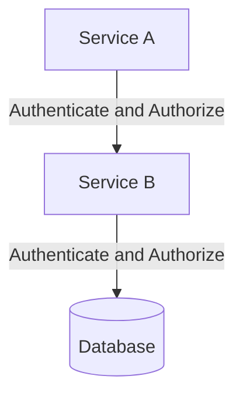
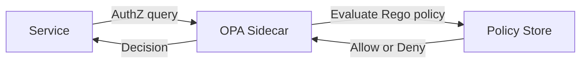

# Zero Trust Architecture — Deep Dive

> **Level:** Advanced
> **Pre-reading:** [08 · Security Summary](08-security.md) · [08.03 · Service-to-Service Auth](08.03-service-to-service-auth.md) · [08.04 · API Security Patterns](08.04-api-security-patterns.md)

---

## What Is Zero Trust?

**Zero Trust** is a security model built on the principle: **never trust, always verify** — regardless of network location. The traditional perimeter model assumed anything inside the network was trusted. Zero Trust eliminates the perimeter entirely.

---

## The Five Pillars of Zero Trust

| Pillar | Description | Implementation |
|:-------|:------------|:---------------|
| **Identity** | Every user, service, and device has a verified identity | SPIFFE, mTLS, OAuth2, MFA |
| **Device** | Only healthy, compliant devices can access resources | MDM, device attestation, posture checks |
| **Network** | Micro-segmentation; no implicit trust on the internal network | K8s NetworkPolicy, Istio AuthorizationPolicy |
| **Application** | AuthN + AuthZ at every API call, not just at the edge | JWT validation in each service, OPA |
| **Data** | Classify data; encrypt in transit and at rest; audit access | KMS, column-level encryption, audit logs |

---

## Zero Trust in Kubernetes

### Network Micro-Segmentation with NetworkPolicy

By default, all pods in K8s can talk to all other pods. NetworkPolicy adds firewall rules at L3/L4.

!!! tip "Default-deny is the starting point"
    Apply a default-deny NetworkPolicy to every namespace, then explicitly allow only required traffic.

### Istio Authorization Policy (L7 Zero Trust)

Istio AuthorizationPolicy adds L7 awareness on top of NetworkPolicy — allow/deny based on HTTP method, path, and JWT claims.

---

## Open Policy Agent (OPA) — Policy as Code

**OPA** decouples policy from application code. Policies are written in **Rego** and evaluated externally.

| OPA Integration Point | Description |
|:---------------------|:------------|
| **Kubernetes Admission** | OPA Gatekeeper validates K8s resources before creation |
| **API Gateway** | OPA evaluates requests at the gateway layer |
| **Service sidecar** | Every service queries OPA for authorization decisions |
| **Envoy External Auth** | Istio/Envoy delegates AuthZ to OPA via gRPC |

---

## Assume Breach Design Principles

| Principle | Implementation |
|:----------|:---------------|
| **Minimize blast radius** | Least privilege — each service gets only what it needs |
| **Lateral movement prevention** | Network segmentation (NetworkPolicy, VLAN) |
| **Short-lived credentials** | Auto-rotating tokens, dynamic secrets, SVIDs |
| **Immutable infrastructure** | Replace compromised components; do not patch in place |
| **Detect, not just prevent** | Anomaly detection, behavioral analytics, SIEM |
| **Incident response automation** | Auto-revoke credentials, isolate pod, trigger alert |

---

## Zero Trust Maturity Model

| Stage | Characteristics |
|:------|:----------------|
| **Traditional** | VPN-based perimeter; implicit trust inside network |
| **Initial** | MFA everywhere; basic identity checks; some segmentation |
| **Advanced** | Context-aware policies; device posture; micro-segmentation |
| **Optimal** | Full automation; continuous validation; policy as code (OPA); anomaly detection |

!!! note "Zero Trust is a journey, not a destination"
    Start with identity (MFA, strong AuthN) and network segmentation, then layer on policy automation and device posture over time.

---

## Zero Trust vs Traditional Security

| Aspect | Traditional Perimeter | Zero Trust |
|:-------|:----------------------|:-----------|
| **Trust assumption** | Internal network = trusted | No implicit trust anywhere |
| **Authentication** | At perimeter (VPN) | On every request, everywhere |
| **Lateral movement** | Easy once inside | Prevented by micro-segmentation |
| **Remote work** | VPN required | Native; identity-based access |
| **Breach impact** | Attacker has free run inside | Contained by least privilege + segmentation |

---

??? question "What is Zero Trust and why is VPN no longer sufficient?"
    Zero Trust means every request is authenticated and authorized regardless of network location. VPN creates a trusted perimeter: once inside, users and services can move laterally with minimal checks. In a cloud-native world with remote work, multi-cloud, and microservices, perimeters are meaningless. Zero Trust replaces the perimeter with continuous verification of identity, device health, and context.

??? question "How does OPA differ from RBAC?"
    RBAC assigns permissions to roles statically. OPA evaluates policies dynamically at request time with full context (user attributes, resource metadata, time, IP, device posture). OPA policies are code — version-controlled, testable, and auditable.

??? question "What is micro-segmentation?"
    Micro-segmentation divides the network into small zones and enforces strict access controls between them. In K8s, NetworkPolicies restrict pod-to-pod communication to only explicitly permitted flows. A compromised service cannot freely communicate with other services.
