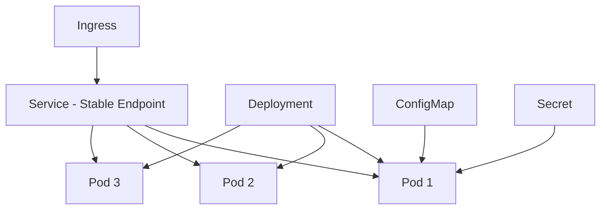
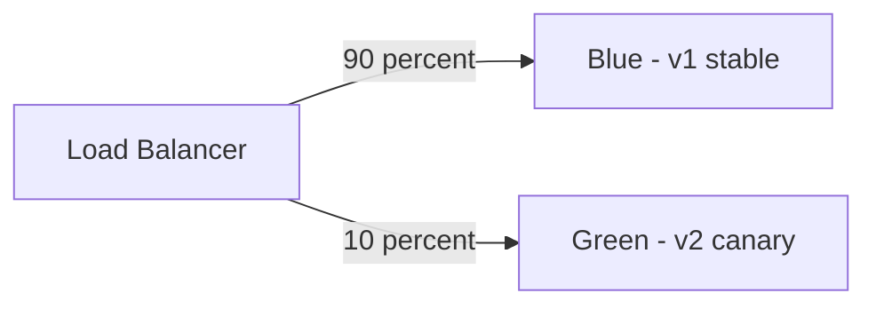

# Deployment & Infrastructure

> Ship confidently. From a Dockerfile to a production canary deployment via GitOps.

## Containers

| Concept             | Description                                                                   |
|:--------------------|:------------------------------------------------------------------------------|
| **Docker image**    | Layered, immutable artifact built from a Dockerfile; build once, run anywhere |
| **Dockerfile**      | Recipe for the image; use multi-stage builds to minimize final image size     |
| **Container vs VM** | Containers share the host OS kernel; lighter and faster but less isolated     |
| **Registry**        | Stores and distributes images; Docker Hub, AWS ECR, GCR, Harbor               |

**Dockerfile best practices:** non-root user, minimal base image (distroless/alpine), no secrets in layers, multi-stage builds, pin versions.

→ **[Deep Dive: Containers and Docker](09.01-containers-and-docker.md)** — Dockerfile best practices, multi-stage builds, image security

## Kubernetes Core Concepts

| Object            | Description                                                                       |
|:------------------|:----------------------------------------------------------------------------------|
| **Pod**           | Smallest deployable unit; 1+ containers sharing network and storage               |
| **Deployment**    | Manages ReplicaSet; desired-state declarative updates; rollback support           |
| **Service**       | Stable network endpoint for a set of pods (ClusterIP, NodePort, LoadBalancer)     |
| **Ingress**       | HTTP/HTTPS routing to services; TLS termination; path-based routing               |
| **ConfigMap**     | Non-sensitive configuration as key-value or config files                          |
| **Secret**        | Sensitive config; base64 encoded at rest — enable encryption at rest with KMS     |
| **Namespace**     | Logical isolation; multi-tenancy within a cluster                                 |
| **HPA**           | Horizontal Pod Autoscaler; scale replicas based on CPU, memory, or custom metrics |
| **VPA**           | Vertical Pod Autoscaler; right-size CPU/memory requests and limits                |
| **PVC / PV**      | PersistentVolumeClaim requests storage; PersistentVolume is provisioned storage   |
| **RBAC**          | Role-based access control for the Kubernetes API; least privilege                 |
| **NetworkPolicy** | Firewall rules for pod-to-pod communication (east-west traffic control)           |

→ **[Deep Dive: Kubernetes Core](09.02-kubernetes-core.md)** — Pods, Deployments, Services, ConfigMaps, Secrets, RBAC, HPA

## Deployment Strategies

| Strategy                 | Description                                                            | Downtime | Rollback Speed  |
|:-------------------------|:-----------------------------------------------------------------------|:---------|:----------------|
| **Recreate**             | Stop all old pods, start new                                           | Yes      | N/A — commit    |
| **Rolling Update**       | Replace pods in batches; old and new briefly coexist                   | No       | Slow            |
| **Blue-Green**           | Two identical environments; flip load balancer instantly               | No       | Instant         |
| **Canary**               | Route small % of traffic to new version; observe; expand gradually     | No       | Fast            |
| **A/B Testing**          | Different versions for different user segments (by header, ID, region) | No       | Per segment     |
| **Shadow (Dark Launch)** | Copy live traffic to new version; ignore its responses                 | No       | N/A             |
| **Feature Flags**        | Toggle features in code without deployment; runtime control            | No       | Instant toggle  |

→ **[Deep Dive: Deployment Strategies](09.03-deployment-strategies.md)** — Rolling, Blue-Green, Canary, Feature Flags

## Helm

| Concept                | Description                                           |
|:-----------------------|:------------------------------------------------------|
| **Chart**              | Package of Kubernetes manifests with Go templating    |
| **Values**             | `values.yaml` — parameters that customize the chart   |
| **Release**            | A deployed instance of a chart in a cluster           |
| **Repository**         | Chart storage; Artifact Hub, AWS ECR, OCI registries  |
| **Upgrade / Rollback** | `helm upgrade` / `helm rollback <release> <revision>` |

→ **[Deep Dive: Helm](09.04-helm.md)** — Charts, values, releases, environment overrides

## GitOps

| Concept                 | Description                                                                           |
|:------------------------|:--------------------------------------------------------------------------------------|
| **GitOps principle**    | Git is the single source of truth for all infrastructure and app config               |
| **Pull-based delivery** | An agent inside the cluster pulls changes from Git (safer; no external push access)   |
| **Push-based delivery** | CI pipeline pushes changes to cluster; simpler but requires cluster credentials in CI |
| **ArgoCD**              | Kubernetes-native GitOps; UI, sync policies, RBAC, drift detection                    |
| **Flux**                | Lightweight GitOps toolkit; Helm and Kustomize support; CNCF graduated                |

→ **[Deep Dive: GitOps](09.05-gitops.md)** — Pull vs Push, ArgoCD, Flux, image update automation

## Service Mesh — Istio Key Concepts

| Component               | Role                                                                       |
|:------------------------|:---------------------------------------------------------------------------|
| **Envoy sidecar**       | Proxy injected into every pod; intercepts all inbound and outbound traffic |
| **Istiod**              | Control plane; pushes config to all sidecars; manages certificates         |
| **VirtualService**      | Traffic routing: canary weights, fault injection, retry rules, timeouts    |
| **DestinationRule**     | Load balancing algorithm, circuit breaking, connection pool settings       |
| **PeerAuthentication**  | Enforce STRICT mTLS between all services in a namespace                    |
| **AuthorizationPolicy** | L7 access control; allow/deny by service account, namespace, HTTP method   |

→ **[Deep Dive: Service Mesh with Istio](09.06-service-mesh-istio.md)** — Envoy, Istiod, VirtualService, mTLS

## The 12-Factor App

| Factor                       | Principle                                                           |
|:-----------------------------|:--------------------------------------------------------------------|
| 1. **Codebase**              | One repo; multiple deploys (dev, staging, prod)                     |
| 2. **Dependencies**          | Explicitly declared in manifest; no implicit system packages        |
| 3. **Config**                | In environment variables; never in code                             |
| 4. **Backing services**      | Attached resources accessed via URL (DB, cache, queue)              |
| 5. **Build / Release / Run** | Strictly separated stages; immutable releases                       |
| 6. **Processes**             | Stateless; share-nothing; state in external backing service         |
| 7. **Port binding**          | App exports via port; no web server injection                       |
| 8. **Concurrency**           | Scale out via process model; horizontal scaling                     |
| 9. **Disposability**         | Fast startup; graceful shutdown on SIGTERM                          |
| 10. **Dev/Prod parity**      | Keep all environments as similar as possible                        |
| 11. **Logs**                 | Treat as event streams; write to stdout; aggregator handles routing |
| 12. **Admin processes**      | Run as one-off processes in the same environment                    |

→ **[Deep Dive: 12-Factor App and IaC](09.07-twelve-factor-and-iac.md)** — 12-Factor principles, Terraform, Pulumi

## CI/CD Pipeline Stages

```mermaid
graph LR
    A[Code Push] --> B[Build]
    B --> C[Unit Tests]
    C --> D[SAST Scan]
    D --> E[Container Build]
    E --> F[Container Scan]
    F --> G[Push Registry]
    G --> H[Deploy Dev]
    H --> I[Integration Tests]
    I --> J[Deploy Staging]
    J --> K[Smoke Tests]
    K --> L[Deploy Prod Canary]
```

**Infrastructure as Code tools:**

| Tool          | Description                                      |
|:--------------|:-------------------------------------------------|
| **Terraform** | Declarative HCL; multi-cloud; state management   |
| **Pulumi**    | IaC with real languages (TypeScript, Python, Go) |
| **AWS CDK**   | TypeScript/Python → CloudFormation               |
| **Helm**      | K8s-specific; package and deploy K8s manifests   |
| **Kustomize** | K8s config overlay patches without templating    |
