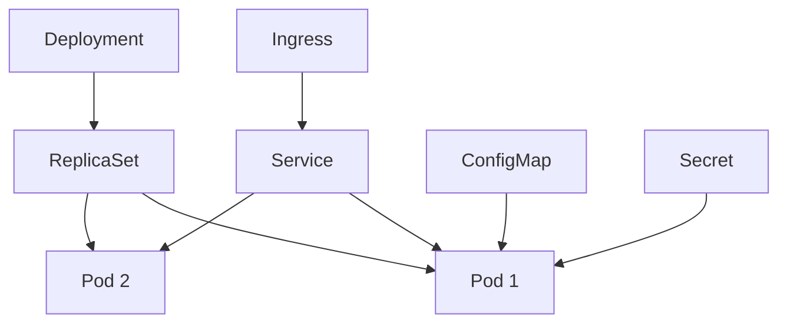

# Kubernetes Core — Deep Dive

> **Level:** Intermediate  
> **Pre-reading:** [09 · Deployment & Infrastructure](09-deployment.md)

---

## Core Objects



| Object | Purpose |
|:-------|:--------|
| **Pod** | Smallest deployable unit; 1+ containers |
| **Deployment** | Manages ReplicaSets; declarative updates |
| **Service** | Stable network endpoint for pods |
| **ConfigMap** | Non-sensitive configuration |
| **Secret** | Sensitive configuration (base64) |
| **Ingress** | HTTP routing and TLS termination |

---

## Pod Specification

```yaml
apiVersion: v1
kind: Pod
metadata:
  name: order-service
  labels:
    app: order
spec:
  containers:
    - name: order
      image: order-service:1.0
      ports:
        - containerPort: 8080
      resources:
        requests:
          memory: "256Mi"
          cpu: "250m"
        limits:
          memory: "512Mi"
          cpu: "500m"
      readinessProbe:
        httpGet:
          path: /actuator/health/readiness
          port: 8080
        initialDelaySeconds: 10
        periodSeconds: 5
      livenessProbe:
        httpGet:
          path: /actuator/health/liveness
          port: 8080
        initialDelaySeconds: 30
        periodSeconds: 10
      env:
        - name: SPRING_PROFILES_ACTIVE
          value: "production"
        - name: DB_PASSWORD
          valueFrom:
            secretKeyRef:
              name: db-secret
              key: password
```

---

## Service Types

| Type | Description | Use Case |
|:-----|:------------|:---------|
| **ClusterIP** | Internal only | Service-to-service |
| **NodePort** | Expose on each node's IP | Development |
| **LoadBalancer** | Cloud load balancer | External access |
| **ExternalName** | DNS alias | External services |

---

## Health Probes

| Probe | Question | Action on Failure |
|:------|:---------|:------------------|
| **livenessProbe** | Is app alive? | Restart pod |
| **readinessProbe** | Is app ready for traffic? | Remove from Service |
| **startupProbe** | Has app started? | Pause liveness/readiness |

---

## Resource Management

```yaml
resources:
  requests:    # Scheduling: guaranteed minimum
    memory: "256Mi"
    cpu: "250m"
  limits:      # Enforcement: maximum allowed
    memory: "512Mi"
    cpu: "500m"
```

| Scenario | Behavior |
|:---------|:---------|
| Exceeds memory limit | Pod killed (OOMKilled) |
| Exceeds CPU limit | Throttled |
| Below requests | May be evicted under pressure |

---

## HPA (Horizontal Pod Autoscaler)

```yaml
apiVersion: autoscaling/v2
kind: HorizontalPodAutoscaler
metadata:
  name: order-hpa
spec:
  scaleTargetRef:
    apiVersion: apps/v1
    kind: Deployment
    name: order-service
  minReplicas: 2
  maxReplicas: 10
  metrics:
    - type: Resource
      resource:
        name: cpu
        target:
          type: Utilization
          averageUtilization: 70
```

---

## RBAC

```yaml
apiVersion: rbac.authorization.k8s.io/v1
kind: Role
metadata:
  name: pod-reader
rules:
  - apiGroups: [""]
    resources: ["pods"]
    verbs: ["get", "list", "watch"]
---
apiVersion: rbac.authorization.k8s.io/v1
kind: RoleBinding
metadata:
  name: read-pods
subjects:
  - kind: ServiceAccount
    name: my-service-account
roleRef:
  kind: Role
  name: pod-reader
  apiGroup: rbac.authorization.k8s.io
```

---

??? question "What's the difference between requests and limits?"
    **Requests** are guaranteed resources used for scheduling — the scheduler places pods where requests can be satisfied. **Limits** are maximums — exceeding memory kills the pod; exceeding CPU throttles it. Set requests based on typical usage; limits based on acceptable peak.

??? question "When should you use readinessProbe vs livenessProbe?"
    **livenessProbe** detects deadlocks/hangs — restart the pod. **readinessProbe** detects temporary unavailability — stop sending traffic until ready. Example: liveness checks if app is alive; readiness checks if dependencies (DB) are connected.

??? question "How do you handle secrets in Kubernetes?"
    (1) K8s Secrets (base64, not encrypted by default). (2) Enable encryption at rest with KMS. (3) Use External Secrets Operator to sync from Vault/AWS SM. (4) Use sealed-secrets for GitOps. (5) Mount as volumes, not env vars for security.

