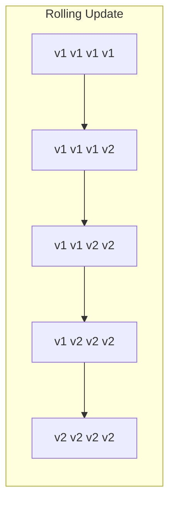
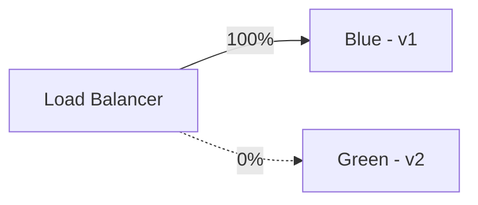
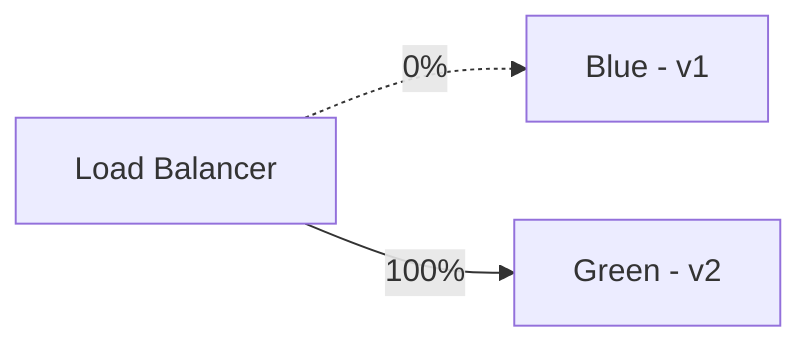
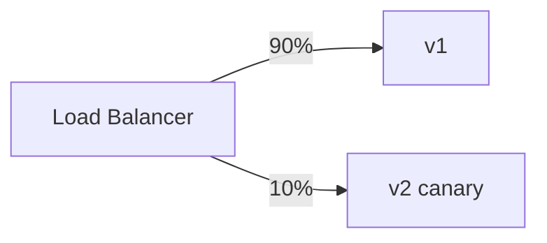

# Deployment Strategies — Deep Dive

> **Level:** Intermediate  
> **Pre-reading:** [09 · Deployment & Infrastructure](09-deployment.md)

---

## Strategy Comparison

| Strategy | Downtime | Rollback | Resource Usage | Risk |
|:---------|:---------|:---------|:---------------|:-----|
| **Recreate** | Yes | Slow | Normal | High |
| **Rolling** | No | Slow | Normal + buffer | Low |
| **Blue-Green** | No | Instant | 2x | Low |
| **Canary** | No | Fast | Normal + small | Very Low |

---

## Rolling Update

```yaml
apiVersion: apps/v1
kind: Deployment
spec:
  replicas: 4
  strategy:
    type: RollingUpdate
    rollingUpdate:
      maxSurge: 1        # Extra pods during update
      maxUnavailable: 0  # Always maintain capacity
```



---

## Blue-Green

Run two identical environments; switch traffic instantly.



After verification:



### Implementation (K8s)

```yaml
# Blue deployment
apiVersion: apps/v1
kind: Deployment
metadata:
  name: order-service-blue
  labels:
    version: blue
---
# Green deployment
apiVersion: apps/v1
kind: Deployment
metadata:
  name: order-service-green
  labels:
    version: green
---
# Service points to active version
apiVersion: v1
kind: Service
metadata:
  name: order-service
spec:
  selector:
    app: order-service
    version: blue  # Switch to green to flip
```

---

## Canary

Route small percentage to new version; expand gradually.



### Istio Canary

```yaml
apiVersion: networking.istio.io/v1beta1
kind: VirtualService
metadata:
  name: order-service
spec:
  hosts:
    - order-service
  http:
    - route:
        - destination:
            host: order-service
            subset: v1
          weight: 90
        - destination:
            host: order-service
            subset: v2
          weight: 10
```

---

## Feature Flags

Toggle features without deployment.

```java
if (featureFlags.isEnabled("new-checkout-flow", userId)) {
    return newCheckoutService.process(order);
} else {
    return legacyCheckoutService.process(order);
}
```

| Tool | Type |
|:-----|:-----|
| **LaunchDarkly** | SaaS |
| **Unleash** | OSS |
| **Split** | SaaS |
| **Flagsmith** | OSS + SaaS |

---

## Rollback

| Strategy | Rollback Method |
|:---------|:----------------|
| **Rolling** | `kubectl rollout undo deployment/order-service` |
| **Blue-Green** | Switch Service selector back |
| **Canary** | Set canary weight to 0% |
| **Feature Flag** | Toggle flag off |

---

??? question "When should you use Blue-Green vs Canary?"
    **Blue-Green**: Instant switchover; good for database migrations that need all-or-nothing. **Canary**: Gradual rollout; catch issues with small user impact. Use canary for most deployments; blue-green when you need atomic switches.

??? question "How do you decide canary percentage and duration?"
    Start small (1-5%) for initial validation. Monitor key metrics. Increase gradually (10%, 25%, 50%, 100%) over hours/days. Duration depends on traffic volume — need enough requests for statistical significance. High-traffic: faster; low-traffic: slower.

??? question "What's the difference between deployment strategy and feature flags?"
    **Deployment strategy** controls which version runs. **Feature flags** control which code path executes within a version. Use deployment strategy for infrastructure changes; feature flags for business logic changes. Often used together.

