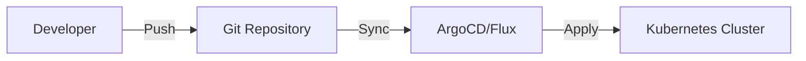

# GitOps — Deep Dive

> **Level:** Intermediate  
> **Pre-reading:** [09 · Deployment & Infrastructure](09-deployment.md)

---

## What is GitOps?

**GitOps** uses Git as the single source of truth for infrastructure and application configuration. Changes are made via Git commits; automated systems sync the desired state to the cluster.



---

## GitOps Principles

| Principle | Description |
|:----------|:------------|
| **Declarative** | Desired state described, not procedures |
| **Versioned** | All changes tracked in Git |
| **Automated** | Agents sync state automatically |
| **Auditable** | Git history = audit trail |

---

## Pull vs Push

| Aspect | Pull-Based | Push-Based |
|:-------|:-----------|:-----------|
| **Flow** | Agent pulls from Git | CI pushes to cluster |
| **Security** | No cluster creds in CI | CI needs cluster access |
| **Tools** | ArgoCD, Flux | kubectl in pipeline |
| **Drift detection** | Automatic | Manual |

---

## ArgoCD

```yaml
apiVersion: argoproj.io/v1alpha1
kind: Application
metadata:
  name: order-service
  namespace: argocd
spec:
  project: default
  source:
    repoURL: https://github.com/org/k8s-config
    path: apps/order-service
    targetRevision: main
  destination:
    server: https://kubernetes.default.svc
    namespace: production
  syncPolicy:
    automated:
      prune: true
      selfHeal: true
    syncOptions:
      - CreateNamespace=true
```

---

## Repository Structure

```
k8s-config/
├── apps/
│   ├── order-service/
│   │   ├── base/
│   │   │   ├── deployment.yaml
│   │   │   ├── service.yaml
│   │   │   └── kustomization.yaml
│   │   └── overlays/
│   │       ├── dev/
│   │       ├── staging/
│   │       └── prod/
│   └── payment-service/
└── infrastructure/
    ├── cert-manager/
    └── external-secrets/
```

---

## Sync Strategies

| Strategy | Description |
|:---------|:------------|
| **Manual** | Sync triggered by human |
| **Auto-sync** | Sync on Git change |
| **Self-heal** | Revert manual cluster changes |
| **Prune** | Delete removed resources |

---

## Image Update Automation

### Flux Image Automation

```yaml
apiVersion: image.toolkit.fluxcd.io/v1beta1
kind: ImagePolicy
metadata:
  name: order-service
spec:
  imageRepositoryRef:
    name: order-service
  policy:
    semver:
      range: ">=1.0.0"
---
apiVersion: image.toolkit.fluxcd.io/v1beta1
kind: ImageUpdateAutomation
metadata:
  name: update-images
spec:
  sourceRef:
    kind: GitRepository
    name: k8s-config
  update:
    path: ./apps
    strategy: Setters
  git:
    commit:
      author:
        name: Flux
        email: flux@example.com
```

---

## Secrets in GitOps

| Approach | Description |
|:---------|:------------|
| **Sealed Secrets** | Encrypt secrets; decrypt in cluster |
| **External Secrets** | Reference secrets from Vault/AWS SM |
| **SOPS** | Encrypt files in Git |

---

??? question "What's the advantage of pull-based GitOps over CI/CD push?"
    **Security**: No cluster credentials stored in CI systems. **Drift detection**: Agent detects and corrects manual changes. **Single source of truth**: Git is the authority. **Auditability**: All changes tracked via Git commits.

??? question "How do you handle environment-specific configurations?"
    Use **Kustomize overlays** or **Helm values files** per environment. Structure: base configuration + environment-specific overlays. ArgoCD/Flux apply the appropriate overlay based on Application configuration.

??? question "How do you promote changes across environments?"
    (1) **PR-based**: PR from dev overlay to staging overlay. (2) **Image-based**: Same manifests, different image tags per env. (3) **Branch-based**: Different branches for different envs. Most common: same repo, different directories/overlays.

