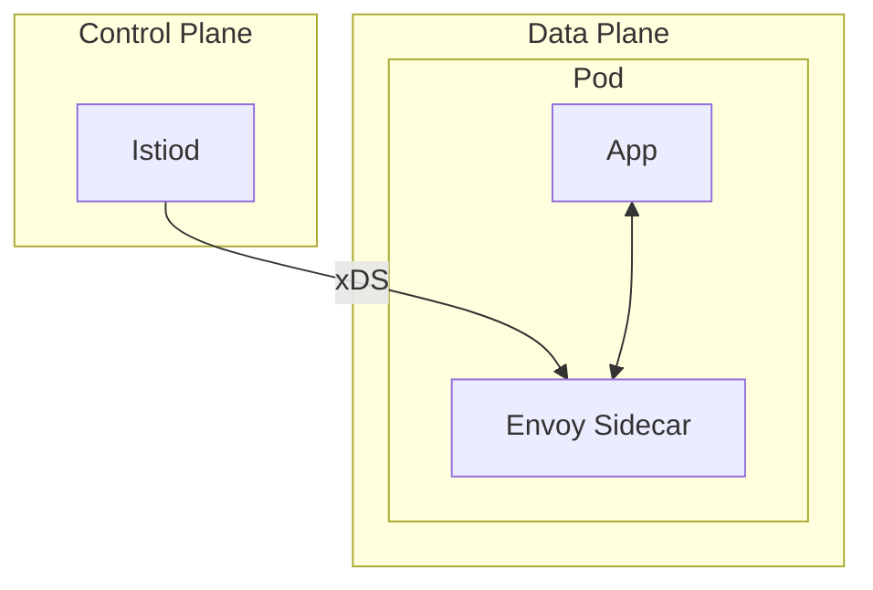

# Service Mesh with Istio — Deep Dive

> **Level:** Advanced  
> **Pre-reading:** [09 · Deployment & Infrastructure](09-deployment.md) · [05.06 · Service Mesh](05.06-service-mesh.md)

---

## Istio Architecture



---

## Key Resources

| Resource | Purpose |
|:---------|:--------|
| **VirtualService** | Traffic routing rules |
| **DestinationRule** | Load balancing, circuit breaking |
| **Gateway** | Ingress/egress configuration |
| **PeerAuthentication** | mTLS policy |
| **AuthorizationPolicy** | Access control |

---

## Traffic Management

### Canary Routing

```yaml
apiVersion: networking.istio.io/v1beta1
kind: VirtualService
metadata:
  name: order-service
spec:
  hosts:
    - order-service
  http:
    - match:
        - headers:
            x-canary:
              exact: "true"
      route:
        - destination:
            host: order-service
            subset: v2
    - route:
        - destination:
            host: order-service
            subset: v1
          weight: 90
        - destination:
            host: order-service
            subset: v2
          weight: 10
```

### Fault Injection

```yaml
http:
  - fault:
      delay:
        percentage:
          value: 10
        fixedDelay: 5s
      abort:
        percentage:
          value: 5
        httpStatus: 503
    route:
      - destination:
          host: order-service
```

---

## Security

### Strict mTLS

```yaml
apiVersion: security.istio.io/v1beta1
kind: PeerAuthentication
metadata:
  name: default
  namespace: production
spec:
  mtls:
    mode: STRICT
```

### Authorization Policy

```yaml
apiVersion: security.istio.io/v1beta1
kind: AuthorizationPolicy
metadata:
  name: order-policy
spec:
  selector:
    matchLabels:
      app: order-service
  rules:
    - from:
        - source:
            principals: ["cluster.local/ns/production/sa/payment-service"]
      to:
        - operation:
            methods: ["POST"]
            paths: ["/api/orders/*"]
```

---

## Observability

Istio provides automatic:

- **Metrics** → Prometheus
- **Traces** → Jaeger
- **Access logs** → Stdout

No code changes required.

---

??? question "When should you adopt Istio?"
    Adopt Istio when: (1) 10+ microservices. (2) Need consistent mTLS. (3) Complex traffic management (canary, fault injection). (4) Multi-language services need uniform observability. Avoid for small deployments — overhead not justified.

??? question "How does Istio mTLS work?"
    Istiod acts as CA, issuing short-lived certificates to each workload's sidecar. Sidecars automatically establish mTLS between services. Certificates rotate every 24 hours. No application changes needed.

??? question "What's the performance overhead of Istio?"
    Envoy adds ~1-3ms latency per hop. Memory: ~50-100MB per sidecar. CPU: depends on traffic. For most applications, acceptable. Profile your specific workload to measure impact.

