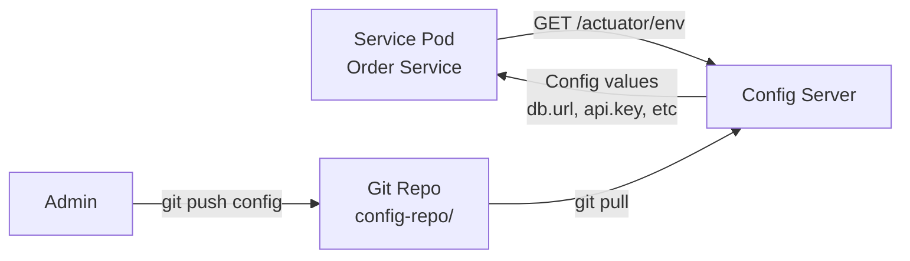

# Configuration Management — Deep Dive

> **Level:** Intermediate
> **Pre-reading:** [09 · Deployment & Infrastructure](09-deployment.md) · [12-Factor App](09.07-twelve-factor-and-iac.md)

---

## Configuration vs Code

**Configuration:** Values that change between environments (dev, staging, prod).
**Code:** Logic that stays the same.

| Item | Type | Where Stored |
|:-----|:-----|:--------------|
| Database URL | Config | Environment variable / ConfigMap |
| Feature flag | Config | ConfigServer / Feature store |
| Price calculation logic | Code | Source code |
| API response format | Code | Source code |
| Kafka broker URL | Config | Environment variable |
| Log level | Config | Environment variable / ConfigMap |

---

## The 12-Factor Rule: Store Config in Environment

Never bake configuration into code:

❌ **Bad:**
```java
public class PaymentConfig {
    public static final String DB_URL = "jdbc:mysql://prod-db:3306/payment";
    public static final String API_KEY = "sk-1234567890"; // Secret in code!
}
```

✅ **Good:**
```java
public class PaymentConfig {
    public String dbUrl = System.getenv("DB_URL");
    public String apiKey = System.getenv("API_KEY");
}
```

**Benefits:**

- Same jar/image for all environments
- Secrets not in Git history
- Change config without rebuild

---

## Configuration Sources (Priority Order)

When reading a config value, check in order:

```
1. Command-line argument      (highest priority)
2. Environment variable       
3. Config file               
4. Application defaults      
5. System properties         (lowest priority)
```

### Example: Reading DB_URL

```bash
# Priority 1: Command-line
java -Dspring.datasource.url=jdbc:mysql://mydb:3306 app.jar

# Priority 2: Environment variable
export DB_URL=jdbc:mysql://mydb:3306
java app.jar

# Priority 3: application.yml
spring:
  datasource:
    url: jdbc:mysql://mydb:3306

# Priority 4: Default in code
@Value("${spring.datasource.url:jdbc:mysql://localhost:3306}")
private String dbUrl;
```

---

## Spring Cloud Config Server

Centralized configuration management; change config without redeploying.

### Architecture



### Setup

**1. Config Server (central service)**

```java
@SpringBootApplication
@EnableConfigServer
public class ConfigServerApplication {
    public static void main(String[] args) {
        SpringApplication.run(ConfigServerApplication.class, args);
    }
}
```

```yaml
# application.yml for Config Server
server:
  port: 8888

spring:
  cloud:
    config:
      server:
        git:
          uri: https://github.com/mycompany/config-repo
          default-label: main
```

**2. Git Repo Structure**

```
config-repo/
├── application.yml                    (shared by all services)
├── order-service.yml                  (Order Service defaults)
├── order-service-dev.yml              (Order Service + dev profile)
├── order-service-staging.yml          (Order Service + staging profile)
├── order-service-prod.yml             (Order Service + prod profile)
└── payment-service.yml
```

**3. Config Client (in Order Service)**

```yaml
# bootstrap.yml (loads BEFORE application.yml)
spring:
  application:
    name: order-service
  cloud:
    config:
      uri: http://config-server:8888
      profile: ${ENVIRONMENT:dev}  # dev, staging, prod
```

**4. Client Reads Config**

```java
@RestController
public class OrderController {
    
    @Value("${database.url}")
    private String dbUrl;
    
    @Value("${payment.api.key}")
    private String apiKey;
    
    @GetMapping("/config-check")
    public Map<String, String> checkConfig() {
        return Map.of(
            "dbUrl", dbUrl,
            "apiKey", apiKey
        );
    }
}
```

---

## Environment-Specific Configuration

### Profile-Based

```yaml
# application.yml
spring:
  profiles:
    active: ${ENVIRONMENT:dev}

---
# application-dev.yml
spring:
  profiles: dev
  datasource:
    url: jdbc:h2:mem:testdb
    driver-class-name: org.h2.Driver

---
# application-prod.yml
spring:
  profiles: prod
  datasource:
    url: jdbc:mysql://prod-rds:3306/payment
    hikari:
      maximum-pool-size: 50
```

### Property Hierarchy

```
application.yml
    ↓
application-${ENVIRONMENT}.yml  (overrides application.yml)
    ↓
Environment variables           (highest priority)
```

---

## Secrets Management

**Never store secrets in ConfigServer or Git.**

### Option 1: External Secrets Manager

```java
@Configuration
public class SecretsConfig {
    
    @Bean
    public String apiKey(@Value("${secrets.api-key}") String apiKey) {
        // Read from AWS Secrets Manager, HashiCorp Vault, or Azure KeyVault
        // via a secrets agent
        return apiKey;
    }
}
```

In Kubernetes, use an External Secrets Operator:

```yaml
apiVersion: external-secrets.io/v1beta1
kind: SecretStore
metadata:
  name: aws-secrets
spec:
  provider:
    aws:
      service: SecretsManager
      region: us-east-1

---
apiVersion: external-secrets.io/v1beta1
kind: ExternalSecret
metadata:
  name: payment-api-secret
spec:
  secretStoreRef:
    name: aws-secrets
  target:
    name: payment-secret       # Create K8s Secret with this name
    template:
      type: Opaque
  data:
    - secretKey: api-key
      remoteRef:
        key: payment-service/api-key
```

Then in application:

```java
@Configuration
public class ApiKeyConfig {
    
    @Bean
    public String apiKey() {
        // Kubernetes mounts secret as file or env var
        return System.getenv("PAYMENT_API_KEY");
    }
}
```

### Option 2: Kubernetes Secrets (Encrypted)

```yaml
apiVersion: v1
kind: Secret
metadata:
  name: payment-secrets
type: Opaque
data:
  api-key: c2stMTIzNDU2Nzg5MA==  # base64 encoded
  db-password: cGFzc3dvcmQxMjM=
```

```yaml
apiVersion: v1
kind: Pod
spec:
  containers:
  - name: payment-service
    env:
    - name: PAYMENT_API_KEY
      valueFrom:
        secretKeyRef:
          name: payment-secrets
          key: api-key
```

---

## Feature Flags (Runtime Configuration)

Change behavior without redeploying.

### Manual Implementation

```java
@RestController
public class OrderController {
    
    @Autowired
    private FeatureFlagService featureFlagService;
    
    @PostMapping("/orders")
    public Order createOrder(@RequestBody OrderRequest request) {
        Order order = buildOrder(request);
        
        // Feature flag: conditionally use new payment processor
        if (featureFlagService.isEnabled("use-new-payment-processor")) {
            order = PaymentService.processWithNewProvider(order);
        } else {
            order = PaymentService.processWithLegacyProvider(order);
        }
        
        return order;
    }
}

@Service
public class FeatureFlagService {
    
    @Autowired
    private ConfigServer configServer;
    
    public boolean isEnabled(String flagName) {
        return configServer.getBoolean("feature.flags." + flagName);
    }
}
```

### External Service (LaunchDarkly, Split.io)

```java
// Evaluate flag with context (user ID, region, etc)
LDUser user = new LDUser.Builder("user-123")
    .country("US")
    .build();

boolean enabled = ldClient.boolVariation(
    "payment-processor-v2",
    user,
    false  // default
);

if (enabled) {
    // Use new payment processor for this user
}
```

**Benefits of external service:**

- Gradual rollout (10% users → 50% → 100%)
- A/B testing (variant A vs variant B)
- Kill switch (disable instantly without redeployment)

---

## Configuration Best Practices

| Practice | Benefit |
|:---------|:--------|
| **Use environment variables for secrets** | Secrets not in code/Git |
| **Store non-secret config in ConfigServer** | Changes without redeployment |
| **Use profiles for environment-specific values** | Same code, different deployments |
| **Document all config values** | Team knows what's available |
| **Validate config on startup** | Fail fast; not in production |
| **Use feature flags for risky changes** | Gradual rollout; easy rollback |
| **Version config like code** | History; audits; rollback if needed |

---

??? question "Should I use ConfigServer or environment variables?"
    Both: environment variables for secrets (API keys, passwords); ConfigServer for non-secret config that changes often (log levels, feature flags, URLs). This separates concerns and keeps secrets secure.

??? question "How do I reload config without restarting the service?"
    Spring Cloud ConfigClient supports `@RefreshScope` annotation. Change config in Git; POST to `/actuator/refresh` endpoint; client reloads. Be careful: some beans don't support refresh; test in staging first.

??? question "Can I store secrets in ConfigServer with encryption?"
    Yes, Spring Cloud ConfigServer supports encrypted values. But it's better to use external secrets manager (Vault, AWS Secrets Manager) for production. ConfigServer is for non-sensitive config.

